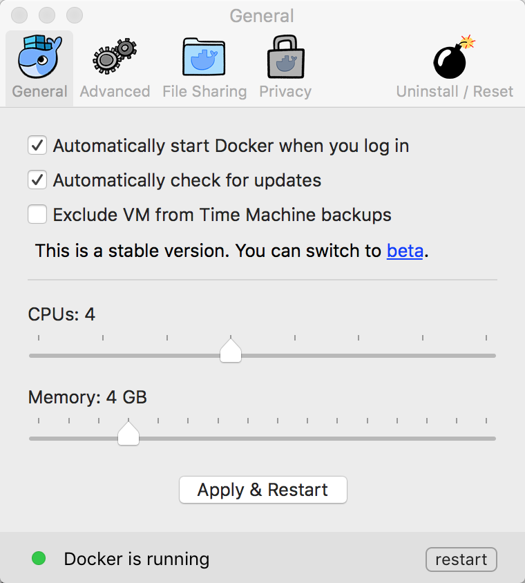
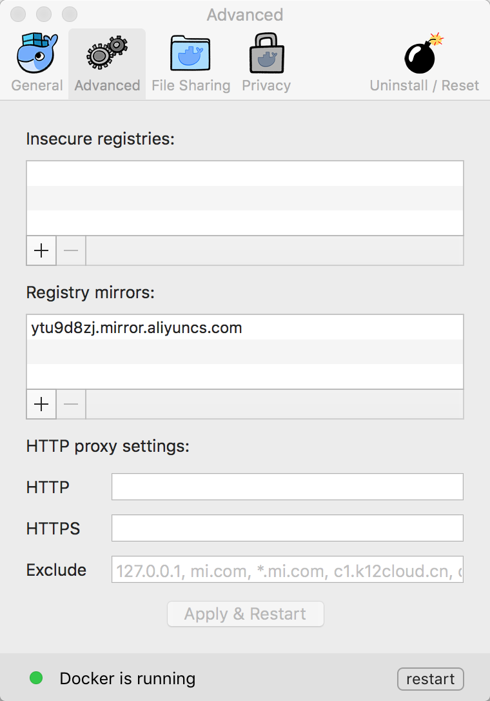
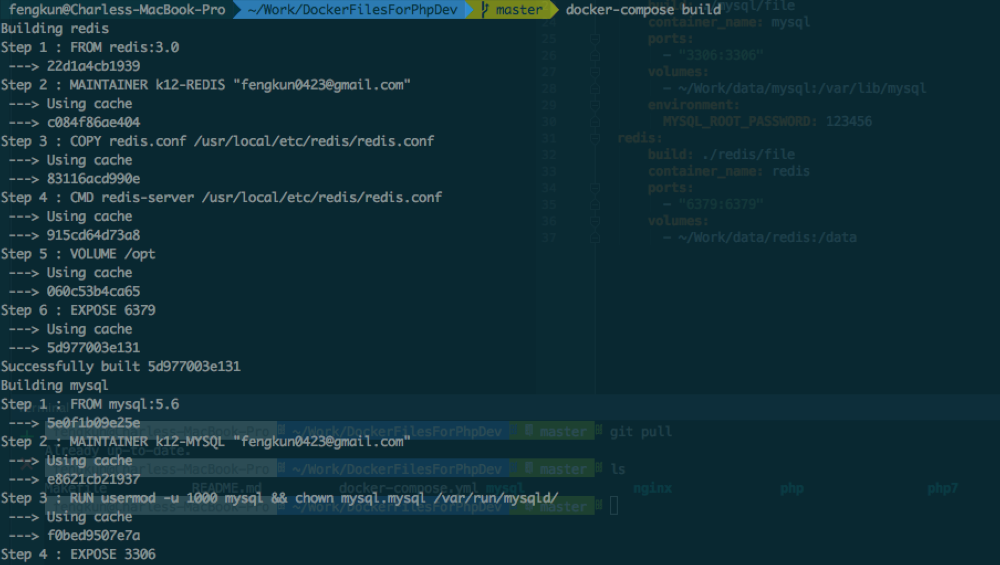
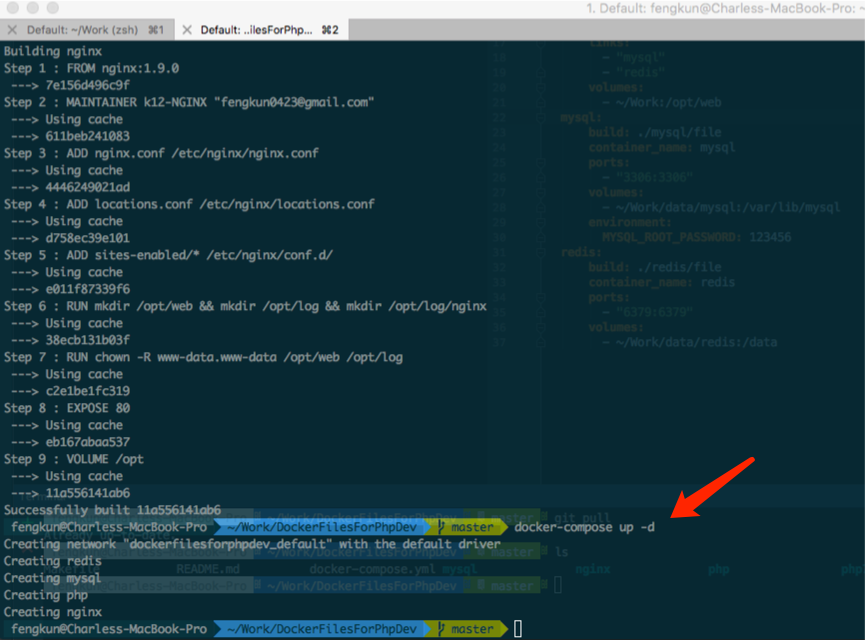
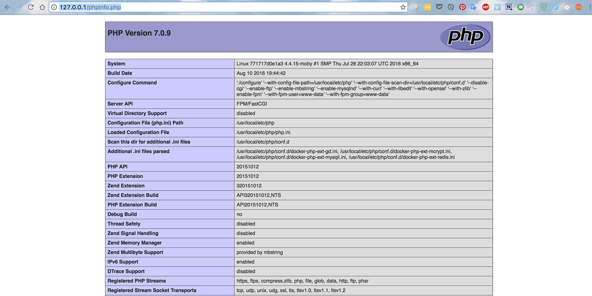

## 配置要求
- Docker
- Docker-compose

我使用的是Mac电脑，Docker新推出了Docker for Mac

Docker for Mac整合了docker-machine , docker-compose
如需下载请[点击此处](https://download.docker.com/mac/stable/Docker.dmg)

## 配置 Docker for Mac

### 设置Docker CUP ， 内存 

安装之后可以更改docker虚拟机配置（内存充足的话，建议提高docker配置）




### 设置Docker镜像，加速下载

这里我用的是aliyun提供的Docker镜像，速度还可以




## Docker-compose 使用

Clone本项目

```
cd ~/Work
git clone https://github.com/charleskun/DockerFilesForPhpDev.git
cd DockerFilesForPhpDev
```

docker-compose 构建docker服务

```
docker-compose build
```
此时会看到：




全部构建成功之后使用docker-compose up -d 开启服务

```
docker-compose up -d
```

此时会看到：




## 测试 phpinfo()

```
echo '<?php phpinfo(); ?>' > ~/Work/phpinfo.php
```

现在可以通过访问`http://127.0.0.1/phpinfo.php` 来查看phpinfo

